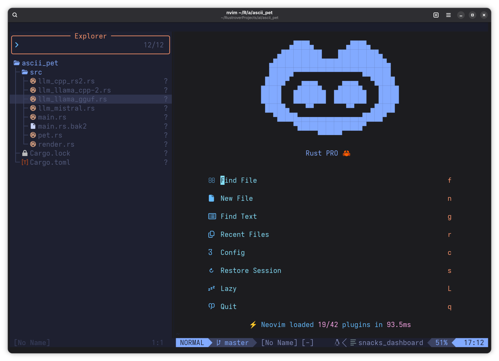

# 🦀 Rust PRO Neovim Configuration

A modern, highly optimized Neovim configuration tailored for **Rust development**. Built with performance and aesthetics in mind, this setup uses `lazy.nvim` for plugin management and features a rich UI, powerful LSP integrations, and a full debugging suite.

## 📋 Requirements

-   **Neovim v0.12+** (v0.12.1 confirmed)
-   **Git**: For plugin management and git-related snacks.
-   **Cargo / Rust Toolchain**: For Rust development and utilities.
-   **C Compiler** (`gcc` or `clang`) & **Make**: Required for building some plugins like `fzf-native`.
-   **Ripgrep** (`rg`): For blazing fast project searching.
-   **Nerd Font**: Highly recommended for icons (e.g., JetBrainsMono Nerd Font).

---

## 🚀 Features

-   **Lightning Fast**: Optimized startup with `lazy.nvim`.
-   **Rust Ready**: First-class Rust support with `rust-analyzer` and `rustaceanvim`.
-   **Rich UI**: Beautiful dashboard, statusline, and tabline powered by `Snacks.nvim` and `Heirline.nvim`.
-   **Debugging**: Full DAP integration for Rust with `codelldb`.
-   **Smart Editing**: Treesitter highlighting, auto-formatting with `conform.nvim`, and improved folding with `nvim-ufo`.

---

## 📦 Plugins

### Core
-   **[lazy.nvim](https://github.com/folke/lazy.nvim)**: Cutting-edge plugin manager.
-   **[tokyonight.nvim](https://github.com/folke/tokyonight.nvim)**: A clean, dark Neovim theme.
-   **[nvim-treesitter](https://github.com/nvim-treesitter/nvim-treesitter)**: Advanced syntax highlighting and code structure.

### UI & UX
-   **[snacks.nvim](https://github.com/folke/snacks.nvim)**: A collection of high-quality UI components (Dashboard, Picker, Explorer, Terminal).
-   **[heirline.nvim](https://github.com/rebelot/heirline.nvim)**: Fully customizable statusline and tabline.
-   **[noice.nvim](https://github.com/folke/noice.nvim)**: Experimental UI for messages, cmdline and the popupmenu.
-   **[trouble.nvim](https://github.com/folke/trouble.nvim)**: A pretty list for showing diagnostics, references, or symbols.
-   **[which-key.nvim](https://github.com/folke/which-key.nvim)**: Displays a popup with available keybindings.
-   **[nvim-scrollbar](https://github.com/petertriho/nvim-scrollbar)**: Extensible Neovim scrollbar.

### Development & LSP
-   **[nvim-lspconfig](https://github.com/neovim/nvim-lspconfig)**: Quickstart configs for Neovim LSP.
-   **[mason.nvim](https://github.com/williamboman/mason.nvim)**: Easily install LSPs, DAPs, linters, and formatters.
-   **[nvim-cmp](https://github.com/hrsh7th/nvim-cmp)**: Autocompletion engine.
-   **[rustaceanvim](https://github.com/mrcjkb/rustaceanvim)**: Supercharge your Rust development.
-   **[crates.nvim](https://github.com/saecki/crates.nvim)**: Manage your Rust crates from within Neovim.
-   **[conform.nvim](https://github.com/stevearc/conform.nvim)**: Lightweight and fast formatter.

### Tools
-   **[nvim-dap](https://github.com/mfussenegger/nvim-dap)**: Debug Adapter Protocol client.
-   **[toggleterm.nvim](https://github.com/akinsho/toggleterm.nvim)**: Manage multiple terminal windows.
-   **[telescope.nvim](https://github.com/nvim-telescope/telescope.nvim)**: Highly extendable fuzzy finder.
-   **[nvim-ufo](https://github.com/kevinhwang91/nvim-ufo)**: Ultra folding in Neovim.

---

## ⌨️ Hotkeys

The **Leader Key** is set to `Space`.

### General
| Key | Action |
| --- | --- |
| `<C-s>` | Save file (Normal/Insert/Visual) |
| `<Esc>` | Clear search highlights |
| `<leader>cd` | Open File Explorer (Netrw) |

### Buffers & Tabs
| Key | Action |
| --- | --- |
| `<Tab>` | Next buffer |
| `<S-Tab>` | Previous buffer |
| `<leader>bd` | Close current buffer (via Snacks) |
| `<leader>tn` | New tab |
| `gt` | Next tab |
| `gT` | Previous tab |

### Navigation (Pickers & Explorer)
| Key | Action |
| --- | --- |
| `<leader><space>` | Smart Find Files |
| `<leader>ff` | Find Files |
| `<leader>fg` | Grep (Live) |
| `<leader>fr` | Recent files |
| `<leader>e` | Toggle File Explorer |
| `<leader>,` | List Buffers |
| `<leader>/` | Grep current project |

### LSP
| Key | Action |
| --- | --- |
| `gd` | Go to Definition |
| `gD` | Go to Declaration |
| `gr` | Show References |
| `K` | Hover Information |
| `<leader>lr` | Rename Symbol |
| `<leader>la` | Code Action |
| `<leader>dn` | Next Diagnostic |
| `<leader>dp` | Previous Diagnostic |
| `<leader>ih` | Toggle Inlay Hints |

### Rust & Cargo
| Key | Action |
| --- | --- |
| `<leader>cb` | Cargo Build |
| `<leader>cc` | Cargo Check |
| `<leader>cl` | Cargo Clippy |
| `<leader>ct` | Cargo Test |
| `<leader>cr` | Cargo Run |

### Debugging (DAP)
| Key | Action |
| --- | --- |
| `<F5>` | Start / Continue Debugging |
| `<F10>` | Step Over |
| `<F11>` | Step Into |
| `<F12>` | Step Out |
| `<leader>db` | Toggle Breakpoint |
| `<leader>du` | Toggle Debug UI |
| `<leader>dq` | Stop Debugging |

### Git
| Key | Action |
| --- | --- |
| `<leader>gg` | Open Lazygit |
| `<leader>gb` | Git Branches |
| `<leader>gs` | Git Status |
| `<leader>gd` | Git Diff (Hunks) |

### Terminal
| Key | Action |
| --- | --- |
| `<C-\>` | Toggle floating terminal |
| `<leader>th` | Horizontal terminal |
| `<leader>tv` | Vertical terminal |

